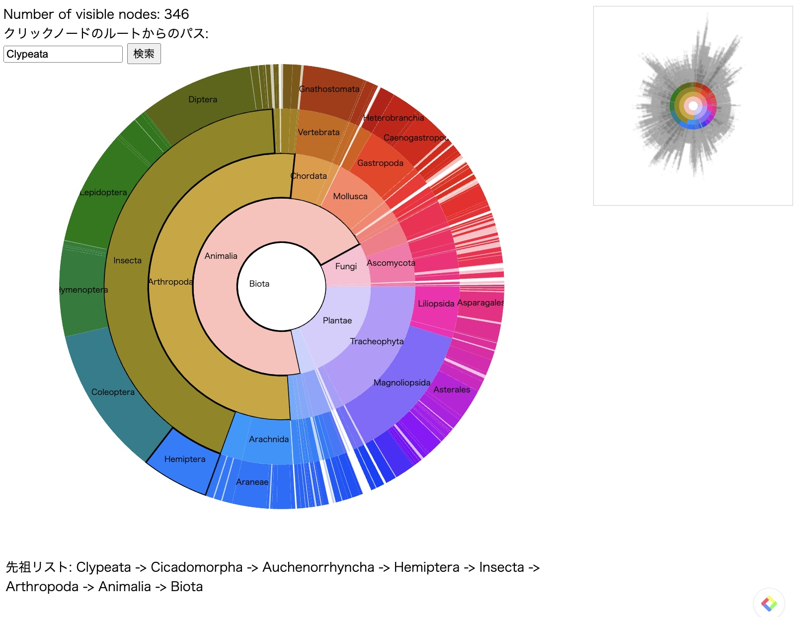

# 系統樹のサンバースト図描画システム

このプロジェクトは、大規模な階層データをサンバースト図で視覚化するシステムです。データ構造を分かりやすく表示し、ユーザーが階層ごとの詳細にアクセスしやすいインタラクティブな操作が可能です。本システムは、ツリー構造データを効果的に表示・操作することを目的としています。

## 概要

このシステムでは、データを階層的にサンバースト図で表示します。サンバースト図は、各ノードのクリック操作に応じてデータが動的に遷移し、指定された階層までの情報が表示される仕組みになっています。サンバースト図のインタラクティブな特性を活かし、ユーザーが階層ごとにデータを探索する体験を提供します。

## 機能

### 表示する層の数制限
データが大規模になると、すべての階層を一度に表示するのは視覚的にもパフォーマンス的にも困難です。そのため、このシステムでは表示する階層の数を制限し、指定された範囲の階層のみを描画します。これにより、ユーザーが最も重要な情報にフォーカスしやすくなります。

- **最大表示層数**: 任意の値で設定可能。デフォルト設定ではルートから5層まで表示。
- **設定変更方法**: 階層の数はコード内で変更でき、特定のビジネス要件に応じて柔軟に適応可能です。

### 隣り合う小さいノードの合体省略表示

本システムでは、サンバースト図上で隣接する小さなノードを自動的に合体し、簡略化する機能を備えています。この機能により、サンバースト図の表示がよりシンプルになり、ユーザーが重要な情報に集中しやすくなります。また、視覚的な負荷の軽減だけでなく、データ量や処理時間の削減といった性能向上も実現しています。

- **合体省略表示の効果**: 
  小さなノードをまとめることで、サンバースト図全体が簡潔になり、レンダリングが最適化されます。特にデータ量が多い場合や階層が深い場合において、表示の高速化とデータ量削減の効果が顕著に表れます。

- **結果の改善**:
  隣接する小さなノードを省略することにより、あるノードをクリックした際に次のような改善が確認されました。

  |   | 省略表示前 | 省略表示後 |
  |---|---|---|
  | ノード数 | 7618 | 497 |
  | データ量 | 1.67MB | 1.09MB |
  | 表示時間 | 293ms | 73ms |

この合体省略表示機能により、データ量が減少するだけでなく、レンダリング速度が向上し、ユーザー体験が大幅に改善されています。

### クリック後の遷移
ユーザーが任意のノードをクリックすると、そのノードをルートとしたサブツリーがサンバースト図として表示され、ズームインするような効果が得られます。クリック操作における遷移機能には以下の特徴があります：

- **逐次遷移**: ノードのクリックにより、階層的なツリー遷移が段階的に行われます。例えば、1.2.1をクリックすると、まずその親ノードの1.2にズームインし、その後サブツリーが更新されて1.2.1がズームインされます。この処理により、階層間の移動が直感的に把握できます。
- **色の動的な変化**: 各ノードの遷移が進行するにつれて、ノードの色も動的に変化します。広範囲の色空間を活用し、よりユーザーにとってノードの見分けを行いやすくします。
- **Overviewの変化**: クリックしたノードの深さと角度をもとに、Overview（全体のサンバースト図）の表示も更新されます。
- **ユーザーによるグラフの回転**: サンバースト図の外側にドラッグ可能なバーを配置。ユーザーが直感的に図を回転して任意の角度で閲覧可能。
- **トランザクションの中心角度設定**: クリックしたノードが画面の中央に表示されるよう、トランジションの中心を自動調整。
ノード間の遷移が視覚的にわかりやすくなります。
#### 図1: 動的な色の変化

### 検索機能
本システムにはノードの名前で検索する機能が搭載されています。ユーザーは特定のノードを名前で検索し、サンバースト図の表示をそのノードにズームインして確認できます。

- **検索実行**: ノードの名前を入力して検索すると、そのノードが見つかり、図の表示がそのノードにフォーカスされます。
- **ハイライト**: 検索結果が表示される際、該当ノードがハイライトされ、ユーザーは容易にその場所を特定することができます。

#### 図2: Clypeata を検索した場合

# TreeOfLife クラスのメソッド説明

`TreeOfLife` クラスは、木構造データを操作するためのクラスです。このクラスには、特定のノード（生命体）の情報を取得するための `life` メソッド、部分木を取得するための `subtree` メソッド、複数の部分木を取得するための `subtrees` メソッドが含まれています。

## クラス変数
- `lives`: 木構造の各ノード（生命体）のリスト。
- `index`: IDとノードのインデックスの対応表。
- `lookup`: 学名とノードのインデックスの対応表。
- `orphans`: 親IDが存在しない孤児ノードのリスト。

## `life` メソッド
`life` メソッドは特定の生命体（ノード）の情報を取得するためのメソッドです。

### 引数
- `name`: 学名（オプション）。
- `n`: ノードのインデックス（オプション）。

### 処理
- `name` が文字列の場合、その学名に対応するインデックスを `lookup` から取得します。
- `n` が整数の場合、そのインデックスに対応するノードの情報を `lives` から取得して返します。

## `subtree` メソッド
`subtree` メソッドは特定のノードをルートとする部分木を取得するためのメソッドです。

### 引数
- `name`: 学名（オプション）。
- `n`: ノードのインデックス（オプション）。
- `depth`: 部分木の深さ（デフォルトは無制限）。

### 処理
- `name` が文字列の場合、その学名に対応するノードを `life` メソッドで取得します。
- `n` が整数の場合、そのインデックスに対応するノードを `life` メソッドで取得します。
- 指定された深さまで再帰的に子ノードを取得し、部分木を構築します。
- リーフノード（深さが0になるノード）は子ノードを持たないようにします。
- 部分木とリーフノードのリストを返します。
