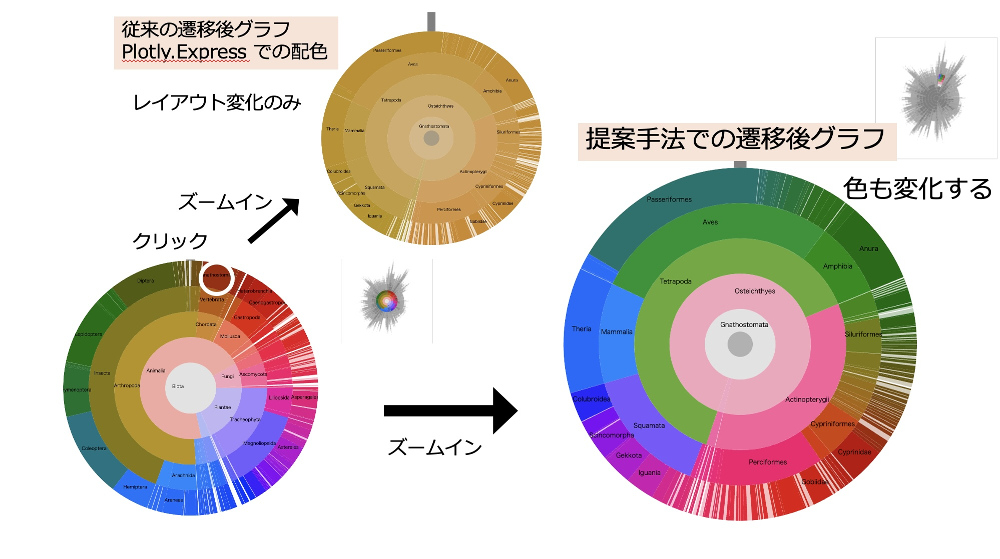
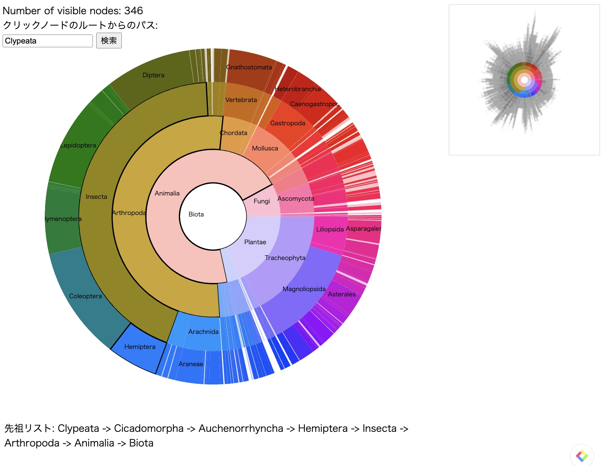

# Sunburst Tree Visualization System for Phylogenetic Trees

This project is a system for visualizing large-scale hierarchical data using Sunburst charts. It provides an intuitive representation of data structures and enables interactive operations that allow users to easily access details at each hierarchical level. The system is designed to effectively display and manipulate tree-structured data. 

*Note: The phylogenetic tree dataset is extremely large (700MB), so it is not included in this repository. Instead, a smaller sample dataset with the same structure (`simple_withValue.json`) is provided.*

## Overview

This research aims to visualize massive tree structures and proposes a novel method using dynamic coloring techniques. Conventional static coloring methods for trees attempt to clearly visualize tree structures; however, in large-scale trees, distinguishing colors between adjacent nodes becomes difficult. This work addresses the problem by dynamically applying similar coloring schemes to locally displayed portions of the tree structure. By incorporating smooth animations that continuously change both node positions and colors during zoom operations, the system reduces the psychological burden caused by node recoloring. The proposed method is applicable to large-scale tree structures in general. Its effectiveness was demonstrated using a biological taxonomy tree consisting of two million nodes through performance measurements and user studies.

## Features

### Limiting the Number of Displayed Layers

When the dataset becomes extremely large, displaying all hierarchical levels at once is difficult both visually and computationally. Therefore, this system limits the number of displayed layers and renders only the specified hierarchy range. This allows users to focus on the most important information.

* **Maximum Display Depth**: Can be set to any value. By default, up to five layers from the root are displayed.
* **Configuration Method**: The number of displayed layers can be modified directly in the code, allowing flexible adaptation to specific business requirements.

### Merging and Simplifying Adjacent Small Nodes

This system includes a feature that automatically merges adjacent small nodes on the Sunburst chart to simplify the visualization. This makes the Sunburst chart easier to understand and helps users focus on important information. In addition to reducing visual clutter, this feature also improves performance by reducing data size and processing time.

* **Effects of Merging and Simplification**:
  By combining small nodes, the overall Sunburst chart becomes more concise and rendering is optimized. Especially when handling large datasets or deep hierarchies, the improvements in rendering speed and data reduction become significant.

* **Performance Improvements**:
  By simplifying adjacent small nodes, the following improvements were observed when clicking a node.

  |                 | Before Simplification | After Simplification |
  | --------------- | --------------------- | -------------------- |
  | Number of Nodes | 7618                  | 497                  |
  | Data Size       | 1.67MB                | 1.09MB               |
  | Rendering Time  | 293ms                 | 73ms                 |

This simplification feature not only reduces data size but also improves rendering speed, significantly enhancing the user experience.

### Transition After Clicking

When a user clicks a node, the subtree rooted at that node is displayed as a new Sunburst chart, creating a zoom-in effect. The transition mechanism has the following characteristics:

* **Sequential Transition**:
  Clicking a node performs hierarchical transitions step by step. For example, when clicking node `1.2.1`, the system first zooms into its parent node `1.2`, then updates the subtree and zooms into `1.2.1`. This process makes hierarchical navigation intuitive.

* **Dynamic Color Changes**:
  As node transitions progress, node colors also change dynamically. By utilizing a wide color space, nodes become easier to distinguish.

* **Overview Update**:
  Based on the depth and angle of the clicked node, the overview (the entire Sunburst chart) is also updated.

* **User-Controlled Graph Rotation**:
  A draggable bar is placed outside the Sunburst chart, allowing users to rotate the chart freely and inspect it from any angle.

* **Center Angle Adjustment for Transitions**:
  The transition center is automatically adjusted so that the clicked node appears at the center of the screen. This makes transitions between nodes visually easier to understand.

#### Figure 1: Dynamic Color Transitions

 

### Search Function

The system provides a search function that allows users to search for nodes by name. Users can search for a specific node and zoom into it within the Sunburst chart.

* **Search Execution**:
  When a node name is entered, the system locates the node and focuses the visualization on it.

* **Highlighting**:
  Search results are highlighted so users can easily identify the corresponding node.

#### Figure 2: Searching for Clypeata

# Description of TreeOfLife Class Methods

The `TreeOfLife` class is used to manipulate tree-structured data. This class includes the `life` method for retrieving information about a specific node (organism), the `subtree` method for retrieving a subtree, and the `subtrees` method for retrieving multiple subtrees.

## Class Variables

* `lives`: A list of all nodes (organisms) in the tree structure.
* `index`: A mapping table between node IDs and indices.
* `lookup`: A mapping table between scientific names and node indices.
* `orphans`: A list of orphan nodes whose parent IDs do not exist.

## `life` Method

The `life` method retrieves information about a specific organism (node).

### Arguments

* `name`: Scientific name (optional).
* `n`: Node index (optional).

### Processing

* If `name` is a string, the corresponding index is retrieved from `lookup`.
* If `n` is an integer, the corresponding node information is retrieved from `lives` and returned.

## `subtree` Method

The `subtree` method retrieves a subtree rooted at a specified node.

### Arguments

* `name`: Scientific name (optional).
* `n`: Node index (optional).
* `depth`: Depth of the subtree (unlimited by default).

### Processing

* If `name` is a string, the corresponding node is retrieved using the `life` method.
* If `n` is an integer, the corresponding node is retrieved using the `life` method.
* Child nodes are recursively retrieved up to the specified depth to construct the subtree.
* Leaf nodes (nodes at depth 0) are treated as having no child nodes.
* The method returns the subtree and a list of leaf nodes.

# 系統樹のサンバースト図描画システム

このプロジェクトは、大規模な階層データをサンバースト図で視覚化するシステムである。データ構造を分かりやすく表示し、ユーザーが階層ごとの詳細にアクセスしやすいインタラクティブな操作を可能とする。本システムは、ツリー構造データを効果的に表示・操作することを目的としている。 

※ 系統樹のデータは巨大サイズ（700MB）のため、このリポジトリはございません。同じ構造を持つ、ノード数が少ないサンプルデータ（`simple_withValue.json`）が代わりに入っております。

## 概要

本研究では、巨大な木構造の可視化を目的とし、動的配色技術を用いた新しい手法を提案する。従来の木に対する静的配色方式は、木の構造の明瞭な視覚化を試みたが、大きな木構造において隣接する頂点の色の判別が困難になってしまう。本稿は木構造の局所的に表示された部分に、同様の配色を動的に施す手法によりこの問題を解決する。ズーム操作に伴い、頂点の配置および色を滑らかに変化させるアニメーションを取り入れることで、頂点の再配色に伴うユーザの心理的負担を軽減する。本手法は大規模な木構造一般に適用可能な技術である。その有効性は200万頂点からなる生物種の分類木を用い、実行速度と被験者実験により有効性を示した。

## 機能

### 表示する層の数制限
データが大規模になる場合、すべての階層を一度に表示することは視覚的にもパフォーマンス的にも困難である。そのため、このシステムでは表示する階層の数を制限し、指定された範囲の階層のみを描画する。これにより、ユーザーが最も重要な情報にフォーカスしやすくなる。

- **最大表示層数**: 任意の値で設定可能。デフォルト設定ではルートから5層まで表示。
- **設定変更方法**: 階層の数はコード内で変更でき、特定のビジネス要件に応じて柔軟に適応可能である。

### 隣り合う小さいノードの合体省略表示

本システムでは、サンバースト図上で隣接する小さなノードを自動的に合体し、簡略化する機能を備えている。この機能により、サンバースト図の表示がよりシンプルになり、ユーザーが重要な情報に集中しやすくなる。また、視覚的な負荷の軽減だけでなく、データ量や処理時間の削減といった性能向上も実現している。

- **合体省略表示の効果**: 
小さなノードをまとめることで、サンバースト図全体が簡潔になり、レンダリングが最適化される。特にデータ量が多い場合や階層が深い場合において、表示の高速化とデータ量削減の効果が顕著に表れる。

- **結果の改善**:
  隣接する小さなノードを省略することにより、あるノードをクリックした際に次のような改善が確認された。

  |   | 省略表示前 | 省略表示後 |
  |---|---|---|
  | ノード数 | 7618 | 497 |
  | データ量 | 1.67MB | 1.09MB |
  | 表示時間 | 293ms | 73ms |

この合体省略表示機能により、データ量が減少するだけでなく、レンダリング速度が向上し、ユーザー体験が大幅に改善されている。

### クリック後の遷移
ユーザーが任意のノードをクリックすると、そのノードをルートとしたサブツリーがサンバースト図として表示され、ズームインする効果が得られる。クリック操作における遷移機能には以下の特徴がある：

- **逐次遷移**: ノードのクリックにより、階層的なツリー遷移が段階的に行われる。例えば、1.2.1をクリックすると、まずその親ノードの1.2にズームインし、その後サブツリーが更新されて1.2.1がズームインされる。この処理により、階層間の移動が直感的に把握できる。
- **色の動的な変化**: 各ノードの遷移が進行するにつれて、ノードの色も動的に変化する。広範囲の色空間を活用し、ノードの見分けがより容易になる。
- **Overviewの変化**: クリックしたノードの深さと角度をもとに、Overview（全体のサンバースト図）の表示も更新される。
- **ユーザーによるグラフの回転**: サンバースト図の外側にドラッグ可能なバーを配置し、ユーザーが図を任意の角度で回転させて閲覧可能にする。
- **トランザクションの中心角度設定**: クリックしたノードが画面の中央に表示されるよう、トランジションの中心を自動調整する。これにより、ノード間の遷移が視覚的にわかりやすくなる。
#### 図1: 動的な色の変化
 

### 検索機能
本システムにはノードの名前で検索する機能が搭載されている。ユーザーは特定のノードを名前で検索し、サンバースト図の表示をそのノードにズームインして確認することができる。

- **検索実行**: ノードの名前を入力して検索すると、そのノードが見つかり、図の表示がそのノードにフォーカスされる。
- **ハイライト**: 検索結果が表示される際、該当ノードがハイライトされ、ユーザーは容易にその場所を特定することができる。

#### 図2: Clypeata を検索した場合

# TreeOfLife クラスのメソッド説明

`TreeOfLife` クラスは、木構造データを操作するためのクラスです。このクラスには、特定のノード（生命体）の情報を取得するための `life` メソッド、部分木を取得するための `subtree` メソッド、複数の部分木を取得するための `subtrees` メソッドが含まれています。

## クラス変数
- `lives`: 木構造の各ノード（生命体）のリスト。
- `index`: IDとノードのインデックスの対応表。
- `lookup`: 学名とノードのインデックスの対応表。
- `orphans`: 親IDが存在しない孤児ノードのリスト。

## `life` メソッド
`life` メソッドは特定の生命体（ノード）の情報を取得するためのメソッドです。

### 引数
- `name`: 学名（オプション）。
- `n`: ノードのインデックス（オプション）。

### 処理
- `name` が文字列の場合、その学名に対応するインデックスを `lookup` から取得します。
- `n` が整数の場合、そのインデックスに対応するノードの情報を `lives` から取得して返します。

## `subtree` メソッド
`subtree` メソッドは特定のノードをルートとする部分木を取得するためのメソッドです。

### 引数
- `name`: 学名（オプション）。
- `n`: ノードのインデックス（オプション）。
- `depth`: 部分木の深さ（デフォルトは無制限）。

### 処理
- `name` が文字列の場合、その学名に対応するノードを `life` メソッドで取得します。
- `n` が整数の場合、そのインデックスに対応するノードを `life` メソッドで取得します。
- 指定された深さまで再帰的に子ノードを取得し、部分木を構築します。
- リーフノード（深さが0になるノード）は子ノードを持たないようにします。
- 部分木とリーフノードのリストを返します。
