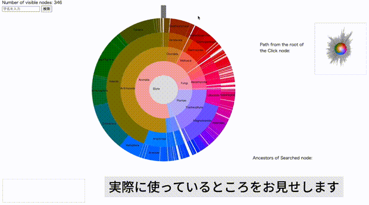
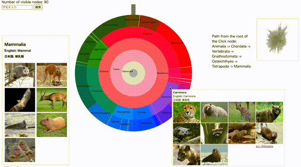
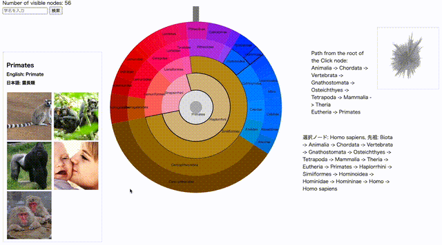

# 情報処理学会第87回全国大会で発表予定

- **標題**: 大規模木構造の閲覧のための動的配色技術
- **著者**: 田中　愛万音、脇田　建
- **日付**: 2025年3月13日 - 2025年3月15日
- **場所**: 立命館大学 大阪いばらきキャンパス

## 概要

## デモビデオ
=======
### デモビデオ1

- 4層目をクリックし、4段階のアニメーションが始まります。

- 四肢動物には
    - 両生類、鳥類、哺乳類、爬虫類 などが含まれていることがわかります。
- ビデオ1の最終形態から、3層目の哺乳類をクリックします。
- 哺乳類には
    - げっ歯類、偶蹄目、霊長類、食肉目 などが含まれていることがわかります。

### デモビデオ3

- 霊長類を押してみます
- 画像のクリック、また検索機能から指定のノードまでのパスがハイライトされます。

### デモビデオ4

- ヒトと、ゴリラと、チンパンジーは分類学的に近しい親戚なのです。

