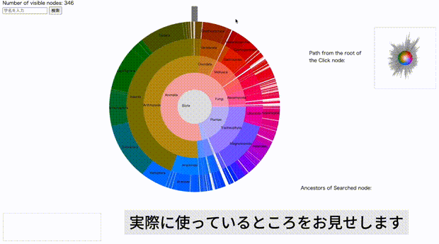
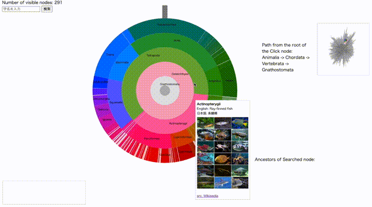

# 情報処理学会第87回全国大会で発表予定

- **標題**: 大規模木構造の閲覧のための動的配色技術
- **著者**: 田中　愛万音、脇田　建
- **日付**: 2025年3月13日 - 2025年3月15日
- **場所**: 立命館大学 大阪いばらきキャンパス

## 概要

## デモビデオ
=======
### デモビデオ1

### デモビデオ2

### デモビデオ3

### デモビデオ4

